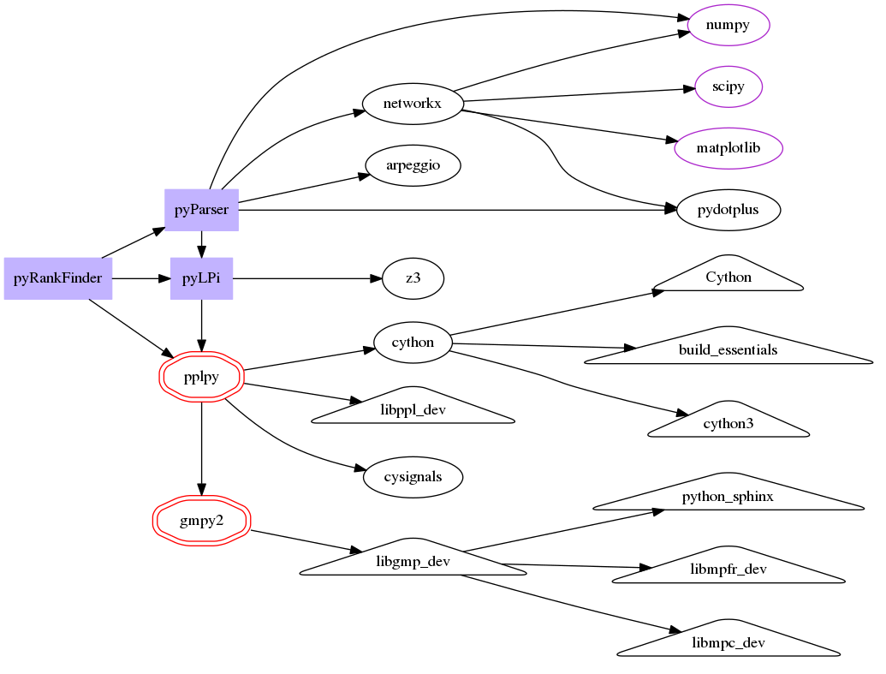

# pyRankFinder
Ranking Functions Finder

Documentation no up to date.

<kbd>pyRankFinder</kbd> is a python module which try to find **Ranking Functions** to study termination in program's loops. 

This module has three main python-module dependencies:
- <kbd>pyLPi</kbd>
- <kbd>pyParser</kbd>
- <kbd>pplpy</kbd>

But they have a lot of other dependencies.

On this graph the ellipses correspond to python modules, that you
can install with pip*, and the triangles correspond to unix libraries.

\* The red ellipse indicates that you have to install the module from its corresponding repository to install the latest (unstable) version and thus support python 3.

We offer a script which install all the dependencies.  (Read "How to Install" section.)

----------

How to Install
------------------

We recommend to have <kbd>ppl</kbd> already installed.

Then you only have to run the script: [install.sh](install.sh) (it will ask you some questions.)

If there are changes on some of the three repositories (pyRankFinder, pyLPi, pyParser),
you can update them by running: [update.sh](update.sh)

And if you want to un-install, you can run the script: [uninstall.sh](unsinstall.sh) (it will ask you some questions.) 

How to Use
---------------

There are two ways to execute this tool. 

The main file is [RankFinder.py](pyRankFinder/RankFinder.py),
you can run this command to get all the information:
> RankFinder.py --help

**(No tested yet)** The second way is: including the module [Termination.py](pyRankFinder/Termination.py)
> import Termination
>
> \# config must be a dictionary with all the information needed
> 
> Termination.run(config)

**(No tested yet)** If you know what are you doing you can run inside your code a concrete algorithm, but it is no recommend if you don't know them

> Import TerminationAlgorithm
>
> TerminationAlgorithem.LexicograficRF(config)

